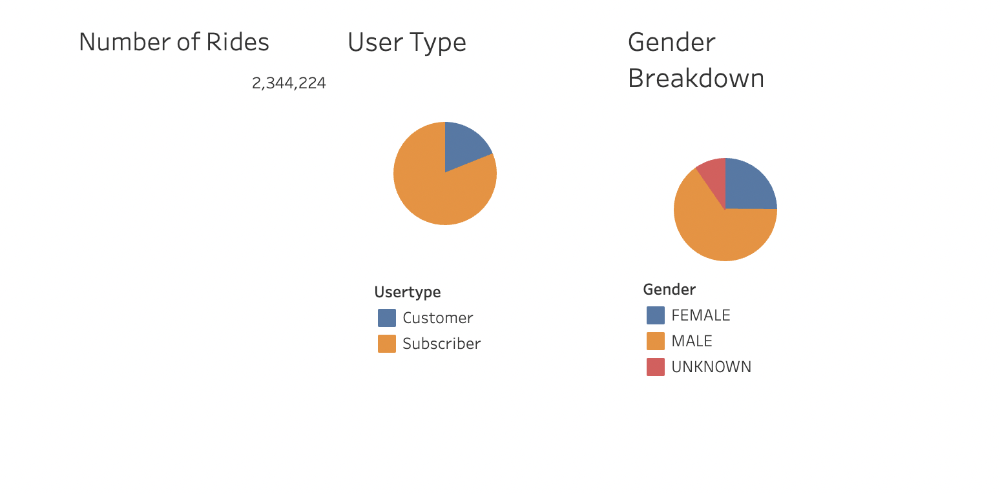
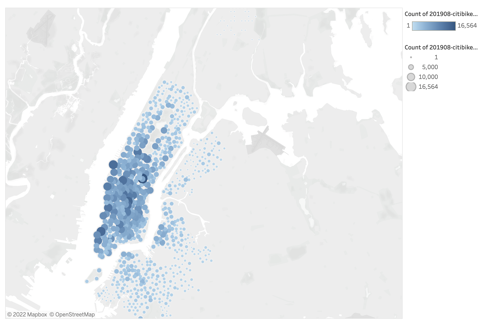
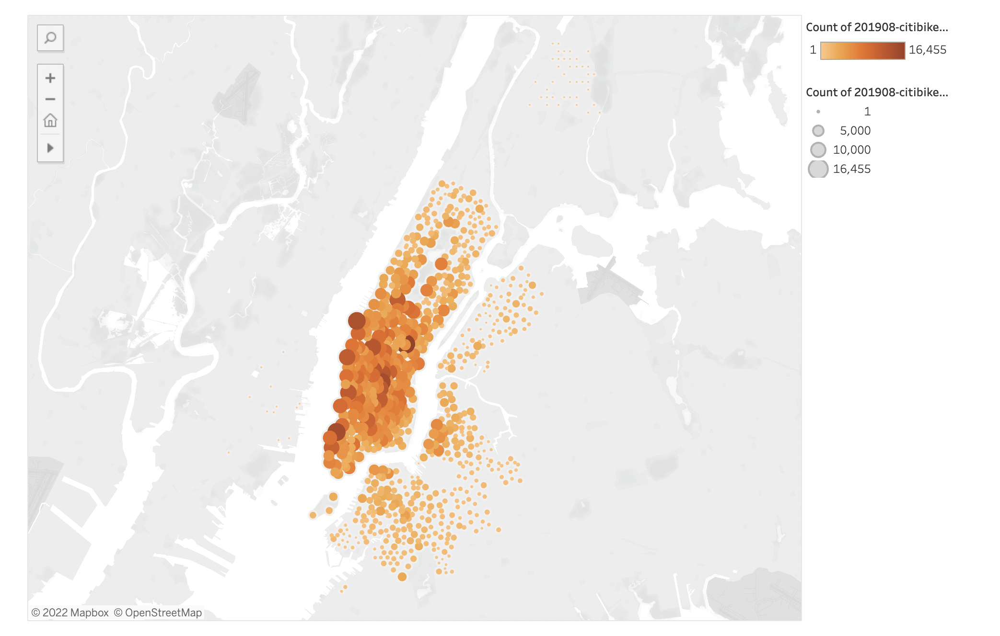
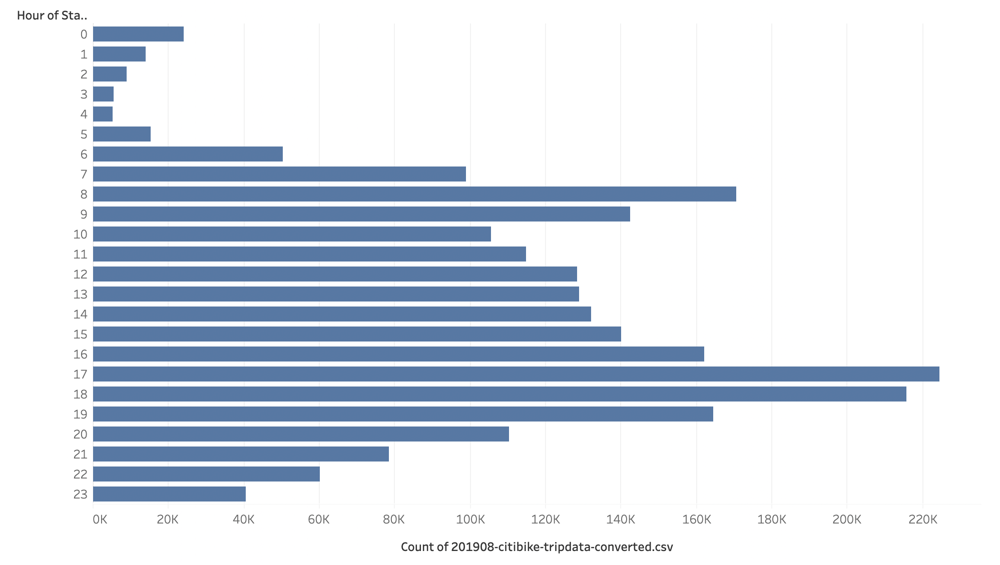
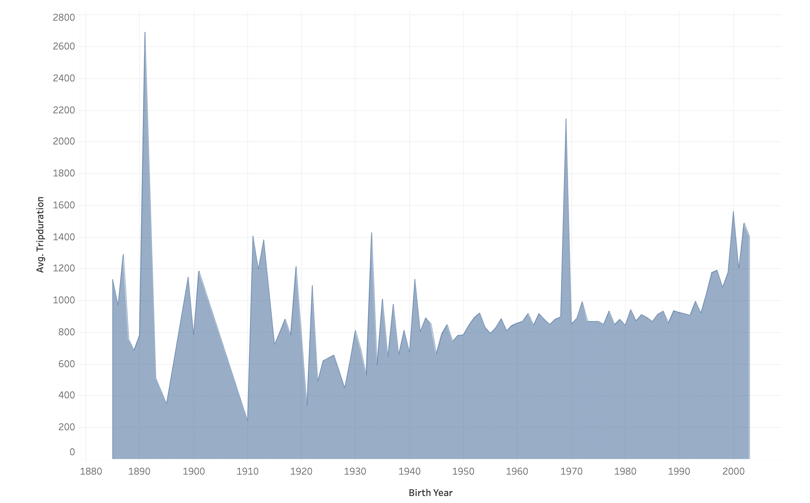
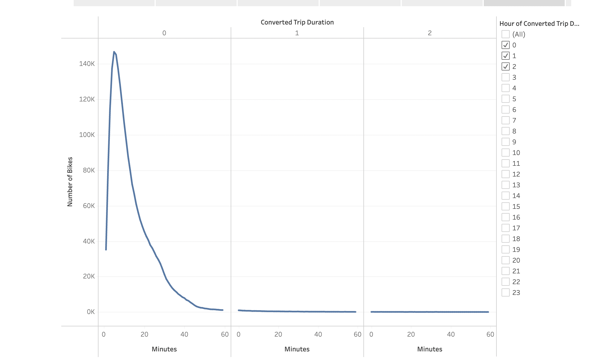
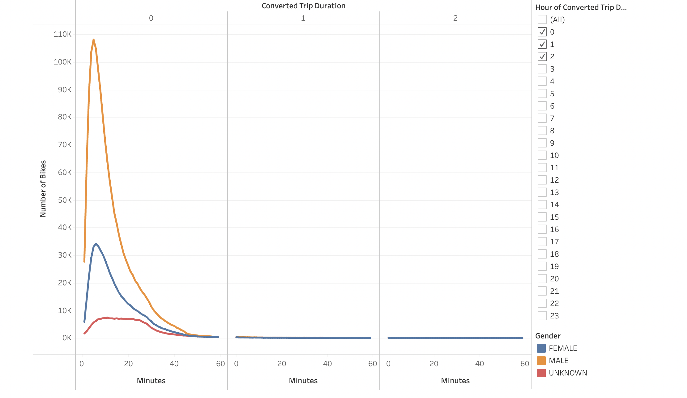
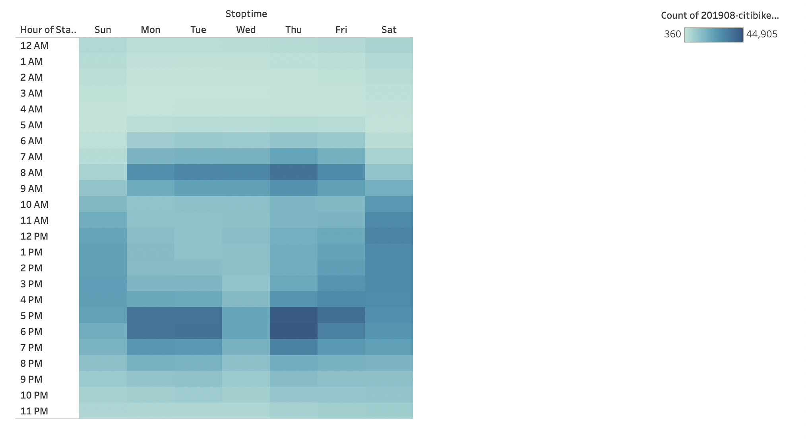
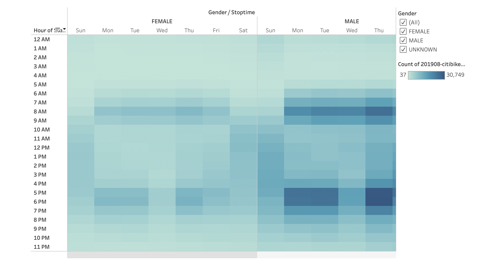
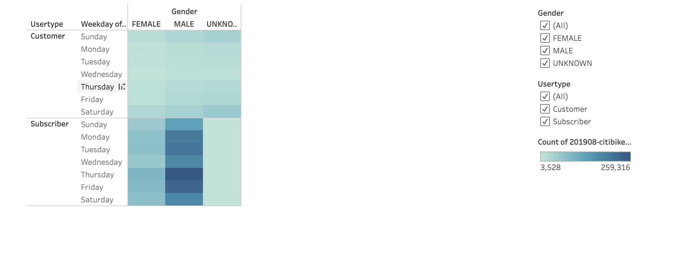

# Bikesharing Analysis with CitiBike

## Overview
Citi Bike is the nation's largest bike share program, with 25,000 bikes and over 1,500 stations across Manhattan, Brooklyn, Queens, the Bronx, Jersey City and Hoboken. In this analysis, I analyzed Citi Bike trip history data from August 2019. I used Pandas to clean the "tripduration" column from an integer to a datetime data type. Then created a set of visualizations in a Tableau story to summarize my analysis.

## Process
First I cleaned the data in a Jupyter Notebook with the Pandas library. First I imported the .csv file and converted to a DataFrame. Using the df.dtypes function I learned the trip duration was measured in seconds, displayed as an integer. For a stronger analysis, I converted the datatype to a datetime format to get the time in hours and minutes. Rather than replace the original data, I added this new format to a new column in the data. I then exported the data as a .csv again for visualizations in Tableau. You can see the full process in this [Jupyter Notebook file](NYC_CitiBike_Challenge.ipynb).
I created visualizations in [Tableau Public](https://public.tableau.com/app/discover).

## Results
The final Tableau Story can be viewed [here](https://public.tableau.com/app/profile/alyssa.davis/viz/BikesharingChallenge_16618926814050/BikesharingChallenge).

Visualization 1: Customer Insights

Analysis
This first story is a combination of several worksheets in a dashboard showcasing the number of rides in August, the customer type breakdown, and customer gender demographics. The majority of users are subscribers and more than half of all customers are male.

Visualization 2: Top Starting Locations

Visualization 3: Top Ending Locations

Analysis

Both of these visuals show the popular areas to begin and end CitiBike rides. The size of the circles and darkness of color show the high volume locations. These areas could be more popular for many reasons, but its likely due to the population size, volume of commuters, and potentitally tourists.

Visualization 4: Peak Hours

This graph shows the most popular times of day for using Citibikes. The lower usage times could be used by the company for repairs and maintenance. 

Visualization 5: Average Trip Duration

This graphs the average time of trip against the users birthyear, but there does not seem to be strong correlations between age and length of trip.

Visualization 6: Checkout Times

Most trips fall between 15-20 minutes. This is likely due to the mobility of bicycling in NY - it doesn't take very long to travel on bike to destinations, or users prefer shorter trips as a sweet spot instead of other forms of transportation. Perhaps its cost effective compared to taxi's, ridesharing, or public transportation.

Visualization 7: Checkout Times by Gender

This visualization further shows how the majority of rides are taken by those identifying as Male. 

Visualization 8: Trips Per Hour

This heatmap highlights the popular hours of each day for the month of August.

Visualization 9: Trips Per Hour By Gender

Tablea makes it easy to update the same graph to show gender filters to see the differences in customer groups.

Visualization 10: Trips Per Hour By Gender & Customer Type

The same graph can be visualized with gender filters and customer type to see the differences in customer groups.

## Summary
- a high-level summary of the results 
- two additional visualizations are suggested for future analysis
- -- Looking at the CitiBike website - there's an option for a single "day pass" - would be interesting to track that in addition to customers and subscribers.

### Resources
Citibike [Data](https://ride.citibikenyc.com/system-data) - August 2019
Python version
Pandas version
Jupyter Notebook version
